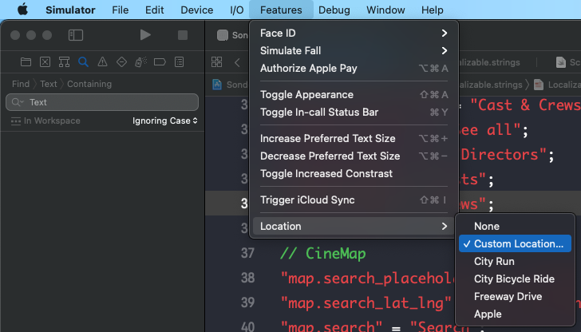

# SonderCine

> This application helps users find directions to a specific cinema and
also provides them useful details of movies.

- Supported OS versions: 13+
- Supported devices: iPhone
- Supported features:
    + Search for places, draw direction.
    + Show movies list
    + Show movie details
    + Show casts & crews list
    + Theme: dark, light
    + Languages: English, Vietnamese

## Built With

- MVVM
- Coordinator
- RxSwift

## Instructions to run

- Clone project
- Use command line to go to project folder and run `pod install`
- Open `SonderCine.xcworkspace`
- Run project on simulaor

### Run on real device
If you want to run on real device, make sure to setup your own `bundle id`, `Certificate` and `Provisioning Profile`

## Notes
In order to test Map feature on simulator, please make sure to enter your desire location.

You can use this coordinate for location in Sydney
latitude: `-33.880707`, longitude: `151.214062`

## Authors

👤 **Duc Nguyen**

- GitHub: [@ducnguyen199x](https://github.com/ducnguyen199x)
- LinkedIn: [LinkedIn](https://linkedin.com/in/ducnguyen285)
